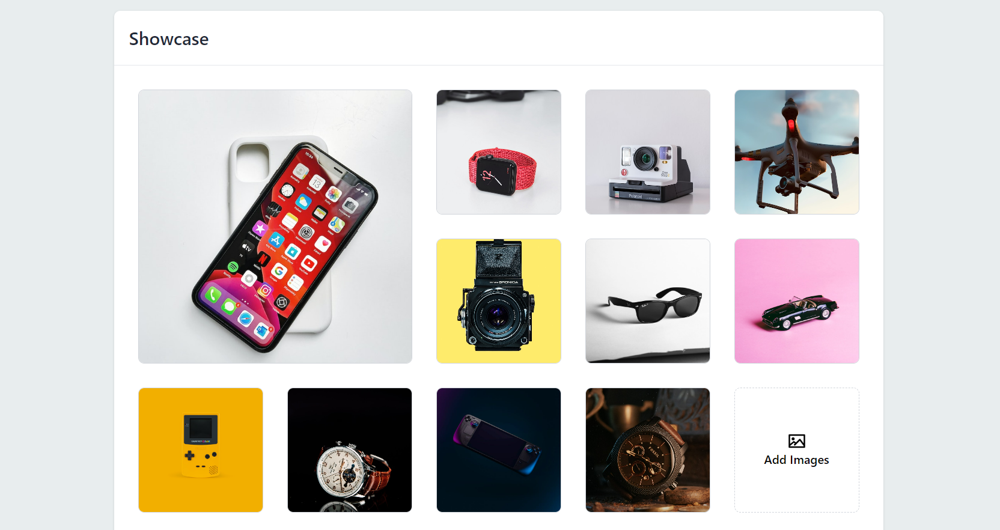

# React TypeScript Image Gallery



Create a responsive and modern image gallery using **React** and **TypeScript**. This starter template provides an easy way to get up and running quickly!

## 🚀 Getting Started

Follow these steps to set up and run the project locally:

### 1. Clone the Repository

You can either:

- Clone the repository using Git:

   ```bash
   git clone https://github.com/your-username/react-typescript-image-gallery.git
